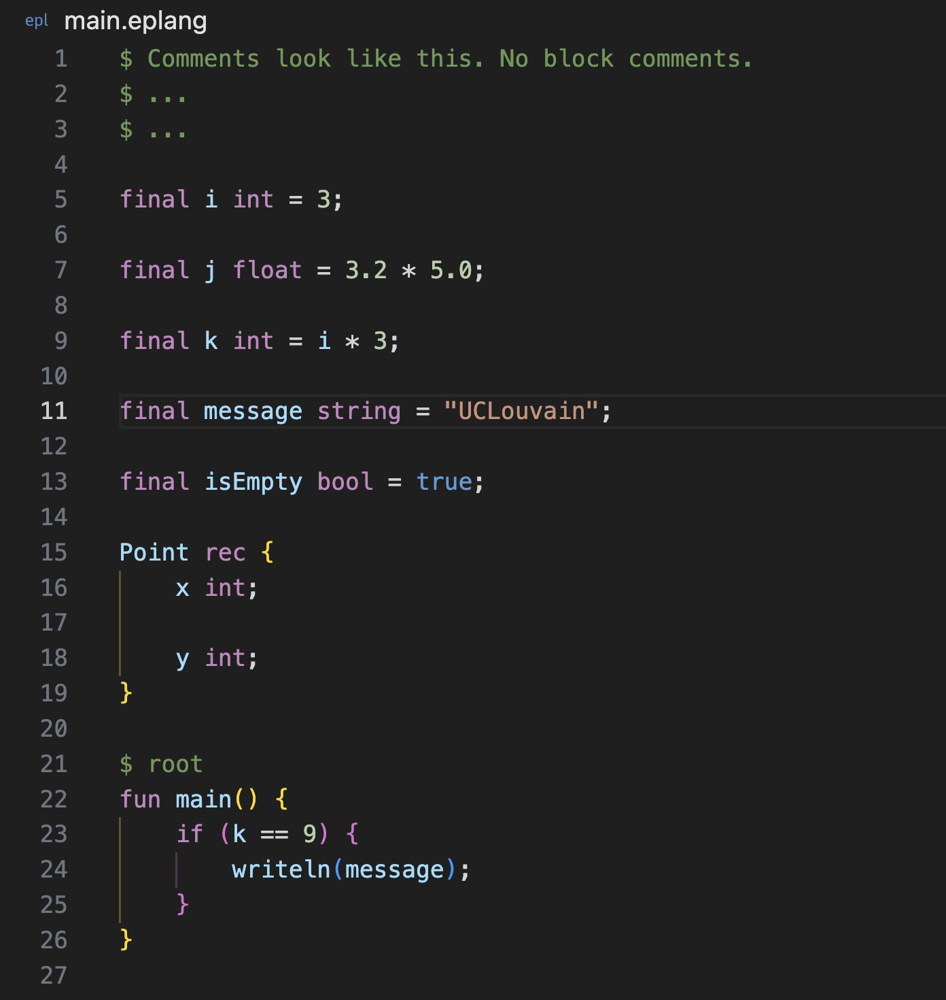

# EPLang Syntax Highlighting for Visual Studio Code

This extension provides syntax highlighting for EPLang files.  
Create a [name]**.eplang** file and start coding to see the extension in action.  
Note that this extension does not perform semantic analysis and should not be used for debugging the code.

## Notes

EPLang is a language created by students of [École Polytechnique de Louvain](https://www.uclouvain.be/fr/facultes/epl) as a project in the LINFO2132 course.  
The extension is mainly for [UCLouvain](https://www.uclouvain.be/fr) students to be used when creating their own compiler in the scope of the LINFO2132 course.

## Install

- Run: `code --install-extension arampetrosyan.eplang-syntax`
  - Alternatively, the extension can be installed via [marketplace](https://marketplace.visualstudio.com/items?itemName=arampetrosyan.eplang-syntax)
- Reload VSCode

## Troubleshooting

[File a bug](https://github.com/arampetrosyann/eplang-syntax-vscode/issues/new) on the Github repository.

## References

- [Language Grammar Rules](https://macromates.com/manual/en/language_grammars)
- [Syntax Highlight Guide](https://code.visualstudio.com/api/language-extensions/syntax-highlight-guide)

<!--

## Working with Markdown
You can author your README using Visual Studio Code. Here are some useful editor keyboard shortcuts:

- Split the editor (`Cmd+\` on macOS or `Ctrl+\` on Windows and Linux).
- Toggle preview (`Shift+Cmd+V` on macOS or `Shift+Ctrl+V` on Windows and Linux).
- Press `Ctrl+Space` (Windows, Linux, macOS) to see a list of Markdown snippets.

## For more information

- [Visual Studio Code's Markdown Support](http://code.visualstudio.com/docs/languages/markdown)
- [Markdown Syntax Reference](https://help.github.com/articles/markdown-basics/)

-->
